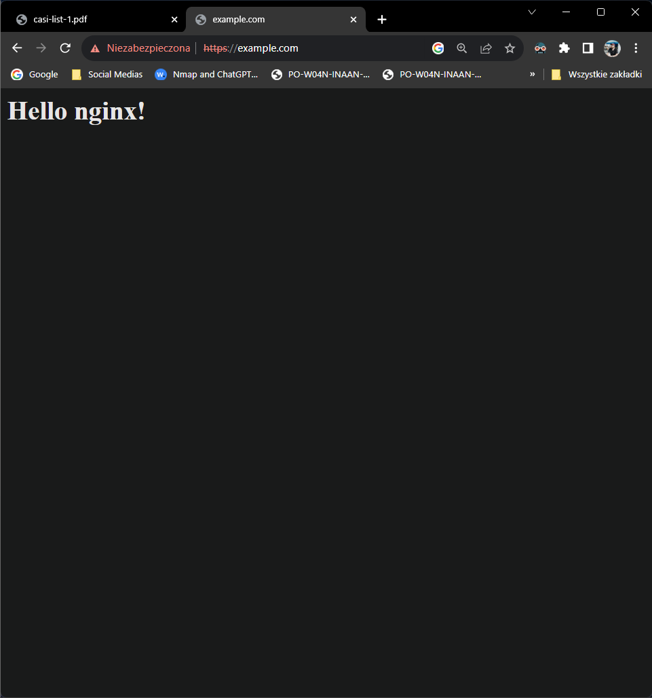
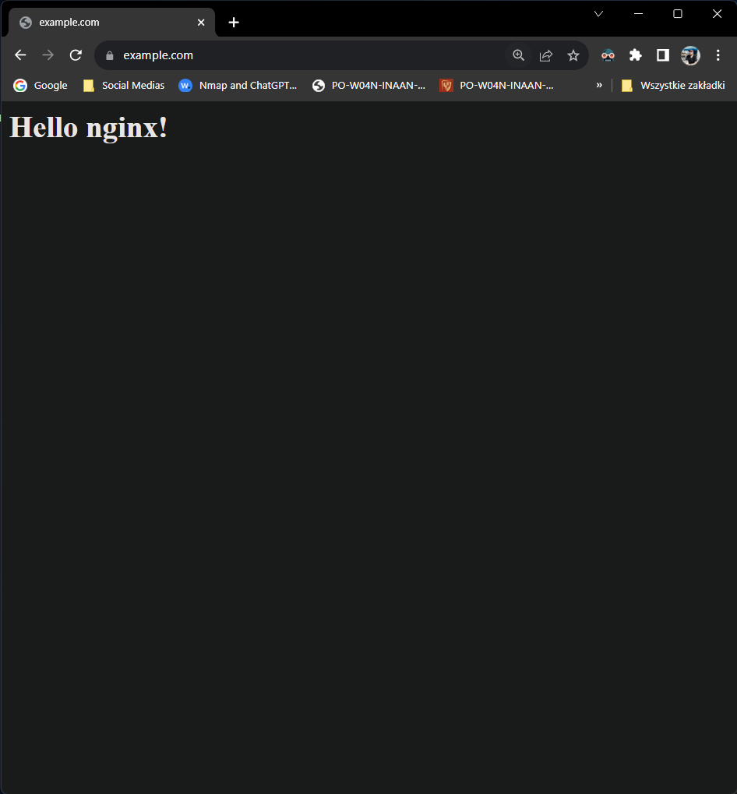

# List 1

## Task 1

1. sha256 sum of file
    ``` bash
    openssl sha256 -hex cs.pwr.edu.pl.pem
    sha256sum cs.pwr.edu.pl.pem
    ```
2. 64 random hex digits
    ``` bash
    openssl rand -hex 64
    dd if=/dev/urandom bs=32 count=1 2>/dev/null | od -An -tx1 | tr -d ' \n'
    ```
3. generate prime numbers
    ``` bash
    openssl prime -generate -hex -bits 2048
    ```
4. encrypt file
   ``` bash
   openssl aes-256-cbc -a -salt -pbkdf2 -in report.md -out report.md.enc
   openssl aes-256-cbc -d -a -pbkdf2 -in report.md.enc -out report.md
   .new
   ```

## Task 2

1. The file is in `*.pem` format.
2. ``` bash
    openssl x509 -in cs_pwr_cert.pem -text -out out.txt
    ```

    - **Who signed the certificate?**\
        The certificate you provided was issued by Let's Encrypt and signed by their intermediate certificate authority (CA) named "R3."present in the certificate:
    - **What is the signature algorithm?**\
        The signature algorithm used for this certificate is "sha256WithRSAEncryption."
    - **Who is the certificate for, including which domains?**\ 
        DNS:cs.pwr.edu.pl, DNS:ifipsec2018.pwr.edu.pl, DNS:ki.pwr.edu.pl, DNS:knsi.pwr.wroc.pl, DNS:settheory.pwr.edu.pl, DNS:studia.cs.pwr.edu.pl, DNS:www.knsi.pwr.wroc.pl
    - **What X509 extensions are present?**\
        The provided X.509 certificate contains several extensions, which are included to provide additional information and attributes associated with the certificate. Here are the X.509 extensions present in the certificate:
       - **Key Usage**: This extension specifies the allowed key usages for the certificate. In this case, it is marked as "critical" and includes "Digital Signature" and "Key Encipherment."

      - **Extended Key Usage**: This extension specifies the purposes for which the public key can be used. It includes "TLS Web Server Authentication" and "TLS Web Client Authentication."

      - **Basic Constraints**: This extension indicates that the certificate is not a Certificate Authority (CA) by setting "CA" to "FALSE." This means that the certificate cannot be used to issue other certificates.

      - **Subject Key Identifier**: This extension provides a unique identifier for the subject's public key.

      - **Authority Key Identifier**: This extension provides a unique identifier for the issuer's (Let's Encrypt's intermediate CA) public key.

      - **Authority Information Access**: This extension includes URIs for both OCSP (Online Certificate Status Protocol) and CA Issuers. These URIs can be used to check the certificate's revocation status and obtain additional certificates from the issuer.

      - **Subject Alternative Name**: This extension lists additional domain names (DNS names) for which the certificate is valid, including subdomains of "cs.pwr.edu.pl."

      - **Certificate Policies**: This extension specifies the certificate policies associated with the certificate.

      - **CT Precertificate SCTs**: This extension includes Signed Certificate Timestamps used in certificate transparency.
    - verify certificate:
        ``` bash
        openssl verify -CApath /ets/ssl/certs/ -untrusted cs_pwr_cert.pem cs_pwr_cert.pem
        ```
    - download new certificate:
        ``` bash
        openssl s_client -showcerts -connect cs.pwr.edu.pl:443 </dev/null > cs_pwr_cert.pem
        ```
## Task 3

generate root certyficat
```
cd root_CA_A
openssl genpkey -algorithm RSA -out private.key
openssl req -x509 -new -key private.key -out certificate.crt -config root_ca_a.conf
```

intermediate 
```
cd intermediate_CA_B
openssl genpkey -algorithm RSA -out private.key
openssl req -new -key private.key -out request.csr -config intermediate_ca_b.conf
openssl x509 -req -days 365 -in request.csr -CA ../root_CA_A/certificate.crt -CAkey ../root_CA_A/private.key -CAcreateserial -out certificate.crt -extfile intermediate_ca_b.conf -extensions v3_ca
```

service certificate
```
cd service_C
openssl genpkey -algorithm RSA -out private.key
openssl req -new -key private.key -out request.csr -config service_c.conf
openssl x509 -req -days 365 -in request.csr -CA ../intermediate_CA_B/certificate.crt -CAkey ../intermediate_CA_B/private.key -CAcreateserial -out certificate.crt -extfile service_c.conf -extensions v3_req
```

combine certificates:
```
cat certificate.crt ../intermediate_CA_B/certificate.crt ../root_CA_A/certificate.crt > certificate_chain.crt
```



After importing root CA into chrome i have:
